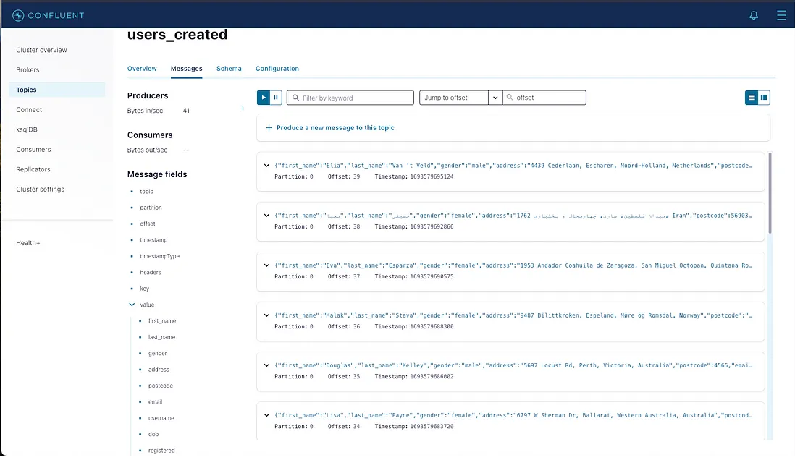

# Realtime Data Streaming

## Introduction

This project employs a multifaceted technological stack to establish an end-to-end data processing pipeline. The workflow commences by fetching data from the randomuser.me API to generate synthetic user data. This raw data is subsequently channeled through Apache Airflow for data orchestration and storage in a PostgreSQL database.

The data is then streamed through Apache Kafka in conjunction with Apache Zookeeper to facilitate real-time data movement from PostgreSQL to the processing engine. For streamlined management and monitoring of Kafka streams, Control Center and Schema Registry are employed to handle schema configurations and ensure effective oversight of the data streams.

Subsequently, Apache Spark is utilized to conduct data processing tasks, following which the processed data is persisted in a Cassandra database, providing a durable storage solution for the refined information.

The entire pipeline is encapsulated within Docker containers, affording a streamlined and portable deployment mechanism.

## System Architecture

## Technologies

- **Data Source**: `randomuser.me` API to generate random user data for the pipeline.
- **Apache Airflow**: Helps orchestrating the pipeline and storing fetched data in a PostgreSQL database.
- **Apache Kafka and Zookeeper**: Used for streaming data from PostgreSQL to the processing engine.
- **Control Center and Schema Registry**: Helps in monitoring and schema management of our Kafka streams.
- **Apache Spark**: For data processing with its master and worker nodes.
- **Cassandra**: Where the processed data will be stored.
- **Docker**: Containerize the entire pipeline.

## Results

- Airflow UI on `localhost:8080`

- Control Center UI on `localhost:9021`

- Topic

- Detail Data

- Data in table Cassandra

## Things to learn

- Establishing a data pipeline using Apache Airflow for workflow orchestration and data management.
- Implementing real-time data streaming through Apache Kafka to facilitate data transfer and processing in real-time.
- Enabling distributed synchronization using Apache Zookeeper for robust coordination and reliability in a distributed system.
- Employing data processing techniques powered by Apache Spark for efficient and scalable data transformation and analysis.
- Utilizing data storage solutions with PostgreSQL and Cassandra to securely store and manage structured and unstructured data, respectively.
- Containerizing the entire data engineering infrastructure with Docker to ensure portability and ease of deployment across various environments.

